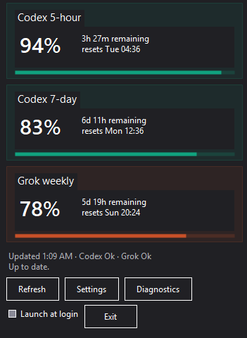
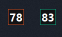

# BuildnBits.Usage

> A Windows 11 notification-area app for checking your remaining Codex and Grok subscription usage at a glance.

[](#requirements)
[](#build-from-source)

## At a glance

- Shows Codex 5-hour and 7-day windows alongside Grok weekly usage.
- Keeps two compact tray icons visible for the Codex and Grok percentages.
- Opens a single status popup with remaining time, reset times, refresh controls, settings, and diagnostics.
- Refreshes on startup, manual refresh, resume from sleep, network recovery, and roughly every 10 minutes.
- Stores usage metadata only—never tokens, cookies, prompts, or account credentials.

## Screenshots

### Usage tracker popup

The popup shows all tracked subscription windows, their remaining percentages, remaining/reset times, and the current provider status.



### Notification-area icons

Two small notification-area icons keep the current Codex and Grok remaining percentages visible without opening the popup.



## How it works

Windows does not provide a supported API for arbitrary inline taskbar widgets. BuildnBits.Usage uses two supported `NotifyIcon` / `Shell_NotifyIcon` icons instead. A Widgets Board card remains in the source as a future plan and is disabled in Settings.

Replacement taskbars such as StartAllBack or ExplorerPatcher may work when they preserve `Shell_NotifyIcon`; compatibility is not guaranteed.

## Providers

| Provider | Connection | What is shown | Authentication |
| --- | --- | --- | --- |
| **Codex** | `codex app-server --listen stdio://` | 5-hour and 7-day remaining usage, reset times | ChatGPT subscription login; API-key authentication is rejected |
| **Grok** | `grok --no-auto-update agent stdio` | Weekly remaining usage and reset time | `cached_token` only |

### Codex

BuildnBits.Usage calls `initialize`, `account/read`, and `account/rateLimits/read`. It recognizes usage windows by duration, including **300 minutes (5-hour)** and **10,080 minutes (7-day)**. Remaining usage is calculated as `100 - usedPercent`, and the Codex tray icon shows the lowest remaining percentage across active windows.

### Grok

The app calls `x.ai/billing` using `cached_token`. It never reads or stores `~/.grok/auth.json` or any other credentials.

## Privacy and cache

The cache contains only percentages, period timestamps, plan labels, and status:

```text
%LOCALAPPDATA%\BuildnBits\Usage\usage-cache.json
```

Tokens, cookies, prompts, and account credentials are never copied or logged.

- **Standard installation:** cache and settings are stored in `%LOCALAPPDATA%\BuildnBits\Usage\`.
- **Portable build:** cache and settings are stored in `data\` next to the executable when `portable.flag` is present.

Temporary refresh failures retain the last successful percentages and mark the status as stale.

## Projects

| Project | Responsibility |
| --- | --- |
| `BuildnBits.Usage.Core` | Models, JSON-RPC stdio client, Codex/Grok parsers, cache, refresh loop, and Adaptive Card JSON |
| `BuildnBits.Usage.Tray` | WinForms host, DPI-aware icons, combined popup, launch-at-login, and diagnostics |
| `BuildnBits.Usage.Widgets` | COM Widgets Board provider |
| `BuildnBits.Usage.Package` | MSIX packaging for the tray app and widget |
| `BuildnBits.Usage.Tests` | Parser, auth, cache, JSON-RPC, icon, and Adaptive Card tests |

## Requirements

- Windows 11
- .NET SDK 8 to build from source
- An authenticated Codex CLI and/or Grok CLI, depending on the providers you use

## Build from source

```powershell
# Run the test suite
dotnet test BuildnBits.Usage.sln

# Build the tray application
dotnet build src/BuildnBits.Usage.Tray/BuildnBits.Usage.Tray.csproj -c Release
```

### Run unpackaged

```powershell
dotnet run --project src/BuildnBits.Usage.Tray/BuildnBits.Usage.Tray.csproj
```

## Portable build

Create a self-contained win-x64 folder with no .NET installation or MSIX required:

```powershell
pwsh -File publish-portable.ps1
```

Run `artifacts\portable\BuildnBits.Usage.Tray.exe`, or extract the GitHub Release asset named `BuildnBits.Usage-<version>-portable-win-x64.zip`.

You can also force portable mode with:

```powershell
$env:BUILDNBITS_USAGE_PORTABLE = "1"
```

Release binaries are created under `artifacts/release/` locally and are not committed.

## MSIX package

### Visual Studio

Install the Windows Application Packaging workload, then open:

```text
src/BuildnBits.Usage.Package/BuildnBits.Usage.Package.wapproj
```

### Command line

Requires the Windows SDK `makeappx` tool:

```powershell
pwsh -File src/BuildnBits.Usage.Package/pack.ps1
```

Explorer restarts re-register the two `NotifyIcon` instances through the documented `TaskbarCreated` broadcast. Icons are not reparented into Explorer.

For development signing, see [the signing guide](src/BuildnBits.Usage.Package/signing/README.md). Private certificates are not committed (`*.pfx` is ignored); the development publisher subject is `CN=BuildnBits-Dev`.

## Settings and future work

Settings—available from either tray icon—cover launch at login, which icons to show, larger tray digits, and the cache folder. Tokens and cookies are never stored in Settings.

Widgets Board integration is currently disabled and tracked in [FUTURE.md](FUTURE.md). The MSIX packaging project remains in the repository for that future work.

## Manual environment checks

Where the host OS allows it, verify the following:

- Explorer restart, auto-hide taskbar, overflow chevron, multiple monitors, mixed DPI, sleep/resume, and light/dark/high-contrast themes.
- Stock Windows 11 taskbar, plus StartAllBack or ExplorerPatcher when installed.
- MSIX installation and widget discovery.
- HTTP 429 responses, network loss, malformed JSON, and process timeouts.

Automated tests cover these error paths where a child process can be spawned.
